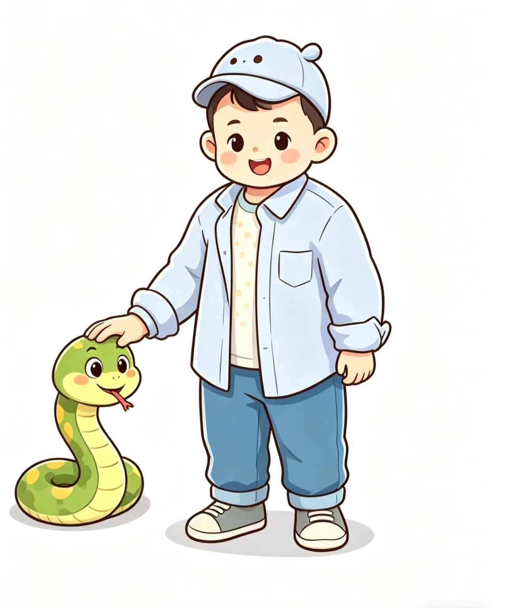

# OpenSnake

学习AI Agent开发，纯古法编程，主打原汁原味体验agent开发的乐趣

向我在AI Agent开发路上的引路人[睿博](https://github.com/Dr-Corgi)致敬🫡，灵感来源于[睿博](https://github.com/Dr-Corgi/OpenPaw)的[OpenPaw](https://github.com/Dr-Corgi/OpenPaw)

## 赞助
你可以通过以下链接帮我砍一刀token

我正在智谱大模型开放平台 BigModel.cn上打造AI应用，智谱新一代旗舰模型GLM-5已上线， 在推理、代码、智能体综合能力达到开源模型 SOTA 水平，通过我的邀请链接注册即可获得 2000万Tokens 大礼包，期待和你一起在BigModel上畅享卓越模型能力；链接：https://www.bigmodel.cn/invite?icode=bd9BFQh%2BZyy3SF8%2FpibGeHHEaazDlIZGj9HxftzTbt4%3D
